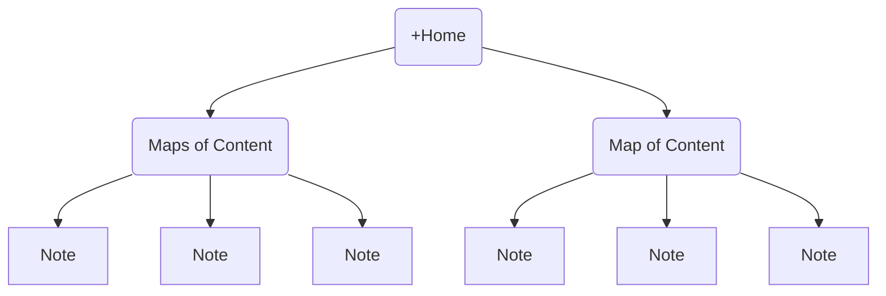

## Introduction
-  [[+Welcome]]
-  [[About me]]

## Maps of content
- [[Hacking MOC|Hacking]]
- [[Programming MOC|Programming]]
- [[Magic the Gathering MOC|Magic: the Gathering]]
- [[Roleplaying MOC|Roleplaying Games]]
- [[Training MOC|Training]]
- [[Polynotes MOC|Miscellaneous notes]]
- [[Series MOC|Series & Movies]]

## Vault structure
