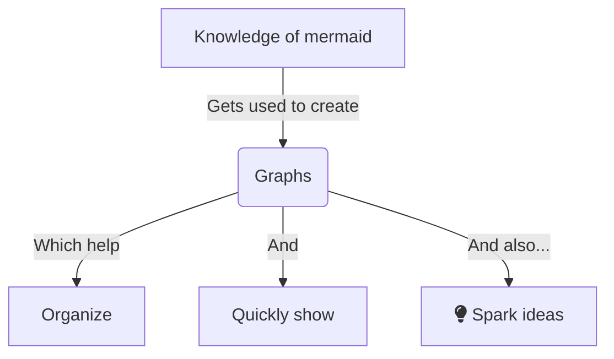

# Mermaid
To see the example, please go into editing view.
If you want to mess around with this, go to [Mermaid live preview](https://mermaid.live/edit)

**Vertical Levels** are defined with Letters at the start of each line.

**Headings** are defined by brackets around the name, round brackets create round icons, square brackets for squares and curly brackets for diamonds.

**Linking** is done with --> arrows.

**Comments**  `%% are hidden`

## Graph types
Mermaid is capable of the following graph types:
- Flow Chart
- Sequence Diagram
- State Diagram
- Entity Relationship Diagram
- User Journey
- Gannt
- Pie Chart
- Requirement Diagram
- Git branch Diagram (experimental)

Specific syntax for these different uses in the [mermaid documentation](https://mermaid-js.github.io/mermaid/#/examples)

___
1. [Flow chart example](https://www.mishacreatrix.com/knowledge-management-flow-diagram-in-obsidian#what-types-of-diagrams-can-you-create-in-mermaidjs)
2. [Mermaid documentation](https://mermaid-js.github.io/mermaid/#/)